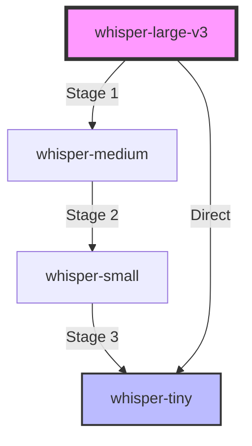

# Knowledge Distillation Product Specification

## Executive Summary

Knowledge Distillation is an advanced training method in the Whisper Fine-Tuner framework that enables the creation of smaller, faster Whisper models while maintaining high accuracy by transferring knowledge from larger "teacher" models to smaller "student" models. This feature is optimized for Apple Silicon and provides sophisticated architecture customization capabilities for creating application-specific models.

## Product Overview

### Purpose
Knowledge Distillation addresses the fundamental trade-off between model accuracy and inference speed by enabling users to:
- Create lightweight models that retain most of the accuracy of larger models
- Deploy efficient speech recognition on resource-constrained devices
- Customize model architectures for specific use cases
- Achieve 50-90% size reduction with minimal accuracy loss


### Core Value Proposition
"Achieve the accuracy of large models with the speed of small ones through intelligent knowledge transfer."

## Technical Architecture

### System Design

#### Teacher-Student Architecture
```
Teacher Model (Large, Pre-trained)
         �
    [Knowledge Transfer]
         �
Student Model (Small, Learning)
```

The system implements a dual-model architecture where:
- **Teacher Model**: Large, pre-trained Whisper model providing high-quality predictions
- **Student Model**: Smaller model learning to mimic the teacher's behavior
- **Knowledge Transfer**: Combined loss function balancing ground truth and teacher predictions

#### Loss Function Design
```
Total Loss = � � KL_Divergence(Student || Teacher) + (1-�) � CrossEntropy(Student, Labels)
```

Components:
- **KL Divergence Loss**: Measures difference between teacher and student probability distributions
- **Cross-Entropy Loss**: Standard supervised loss against ground truth labels
- **� (KL Weight)**: Balancing parameter (default: 0.5) controlling emphasis on teacher vs. ground truth

#### Temperature Scaling
```python
softmax(logits / temperature)
```
- **Purpose**: Smooths probability distributions for better knowledge transfer
- **Range**: 2.0 (conservative) to 10.0 (aggressive)
- **Default**: 5.0 (balanced)
- **Effect**: Higher temperatures reveal more nuanced inter-class relationships

### Architectural Components

#### 1. Model Loader System
Manages dual model loading with compatibility validation:
- Teacher model configuration and loading
- Student model initialization (standard or custom)
- Mel-bin compatibility checking (80 vs 128 bins)
- Memory-efficient loading for unified memory architecture

#### 2. Custom Architecture Builder
Enables creation of hybrid models:
- **Asymmetric Architectures**: Large encoder + small decoder
- **Component Mixing**: Encoder from Model A, decoder from Model B
- **Layer Customization**: Configurable decoder layers, attention heads, FFN dimensions
- **Compatibility Validation**: Ensures matching d_model between components

#### 3. Training Loop
Custom implementation optimized for distillation:
- Teacher inference without gradient computation
- Student training with dual loss computation
- Memory-efficient batch processing
- Platform-specific optimizations (MPS/CUDA/CPU)

#### 4. Data Collator
Specialized batch assembly for distillation:
- Synchronized padding for teacher-student alignment
- Decoder start token handling
- Language-aware batching (strict mode support)
- Memory-efficient tensor operations

## Feature Specifications

### Core Features

#### 1. Standard Distillation
**Description**: Transfer knowledge from a larger teacher to a smaller student of the same architecture family.

**Configuration**:
```python
{
    "teacher_model": "whisper-large-v3",
    "student_model": "whisper-small",
    "temperature": 5.0,
    "kl_weight": 0.5
}
```

**Use Cases**:
- General model compression
- Production deployment optimization
- Cost reduction for cloud inference

#### 2. Custom Hybrid Architecture
**Description**: Create asymmetric models with components from different architectures.

**Configuration**:
```python
{
    "student_model_type": "custom",
    "student_encoder_from": "whisper-large-v3",
    "student_decoder_from": "whisper-tiny",
    "teacher_model": "whisper-large-v3"
}
```

**Architecture Patterns**:
- **Large Encoder + Tiny Decoder**: Maximum speed with quality audio understanding
- **Medium Encoder + Small Decoder**: Balanced performance
- **Domain-Specific Combinations**: Tailored for specific acoustic environments

**Use Cases**:
- Real-time transcription systems
- Mobile/edge deployment
- Streaming applications with latency constraints

#### 3. Progressive Distillation
**Description**: Multi-stage distillation for extreme compression.

**Workflow**:
1. Distill large-v3 � medium (Stage 1)
2. Distill medium � small (Stage 2)
3. Distill small � tiny (Stage 3)

**Benefits**:
- Gradual knowledge transfer
- Better final accuracy than direct distillation
- Intermediate checkpoints for different deployment targets

### Configuration Parameters

#### Model Selection
| Parameter | Type | Description | Default |
|-----------|------|-------------|---------|
| `teacher_model` | string | Teacher model identifier | Required |
| `model_name_or_path` | string | Student model base | Required |
| `student_model_type` | enum | "standard" or "custom" | "standard" |
| `student_encoder_from` | string | Encoder source (custom only) | None |
| `student_decoder_from` | string | Decoder source (custom only) | None |

#### Distillation Hyperparameters
| Parameter | Type | Range | Default | Description |
|-----------|------|-------|---------|-------------|
| `temperature` | float | 1.0-10.0 | 5.0 | Softmax temperature for probability smoothing |
| `kl_weight` | float | 0.0-1.0 | 0.5 | Balance between teacher and ground truth |
| `distillation_alpha` | float | 0.0-1.0 | 0.5 | Alternative name for kl_weight |

#### Architecture Customization
| Parameter | Type | Description | Default |
|-----------|------|-------------|---------|
| `student_decoder_layers` | int | Number of decoder layers | Model default |
| `student_decoder_attention_heads` | int | Attention heads per layer | Model default |
| `student_decoder_ffn_dim` | int | Feed-forward dimension | Model default |

#### Training Configuration
| Parameter | Type | Recommended | Rationale |
|-----------|------|-------------|-----------|
| `per_device_train_batch_size` | int | 4-8 | Dual model memory requirements |
| `gradient_accumulation_steps` | int | 4-8 | Effective large batches |
| `learning_rate` | float | 1e-5 | Lower for stability |
| `warmup_steps` | int | 500 | Extended for convergence |
| `num_train_epochs` | int | 3-5 | Sufficient for knowledge transfer |

### Platform Optimizations

#### Apple Silicon (MPS)
- **Unified Memory**: Efficient dual-model hosting
- **Float32 Precision**: MPS tensor compatibility
- **Memory Pressure Management**: `PYTORCH_MPS_HIGH_WATERMARK_RATIO=0.7`
- **Operation Fusion**: Automatic shader optimization
- **Batch Size**: Start with 4-6 for M1/M2, 6-8 for M1 Max/Ultra

#### NVIDIA CUDA
- **Mixed Precision**: FP16 training with loss scaling
- **Multi-GPU**: Data parallel teacher-student pairs
- **Memory Optimization**: Gradient checkpointing available
- **Batch Size**: 8-16 depending on GPU memory

#### CPU
- **Threading**: Optimized for multi-core systems
- **Memory**: Requires 16GB+ RAM for dual models
- **Batch Size**: 2-4 for reasonable training times

## User Workflows

### Workflow 1: Interactive Wizard Flow

1. **Method Selection**
   ```
   Choose training method:
   > >� Knowledge Distillation
   ```

2. **Model Configuration**
   ```
   Select student model type:
   > Standard (Pre-defined architecture)
   > Custom Hybrid (Mix encoder/decoder)
   ```

3. **Teacher Selection**
   ```
   Select teacher model:
   > whisper-large-v3 (1550M params)
   > whisper-large-v2 (1550M params)
   > whisper-medium (769M params)
   ```

4. **Temperature Configuration**
   ```
   Select temperature:
   > 2.0 (Conservative)
   > 5.0 (Balanced) P Recommended
   > 10.0 (Aggressive)
   ```

5. **Training Execution**
   ```
   Estimated time: 8.5 hours
   Memory usage: 12.4 GB
   Start training? (y/n)
   ```

### Workflow 2: Configuration File

```ini
[profile:distil-small-from-large]
inherits = DEFAULT
dataset = common_voice_13
model = whisper-small
teacher_model = whisper-large-v3
distillation_temperature = 5.0
distillation_alpha = 0.5
per_device_train_batch_size = 4
gradient_accumulation_steps = 4
num_train_epochs = 3
```

### Workflow 3: CLI Direct Invocation

```bash
whisper-tuner finetune \
    --profile distil-small-from-large \
    --override teacher_model=whisper-large-v3 \
    --override temperature=5.0
```

## Performance Characteristics

### Model Size Reduction

| Teacher � Student | Size Reduction | Speed Gain | WER Impact |
|-------------------|---------------|------------|------------|
| Large-v3 � Medium | 50% | 2x | +0.5-1.0% |
| Large-v3 � Small | 77% | 4x | +1.0-2.0% |
| Large-v3 � Base | 90% | 8x | +2.0-3.5% |
| Large-v3 � Tiny | 95% | 12x | +3.0-5.0% |
| Medium � Small | 55% | 2x | +0.5-1.5% |
| Small � Tiny | 75% | 3x | +1.5-3.0% |

### Custom Architecture Performance

| Configuration | Inference Speed | Accuracy Trade-off | Use Case |
|--------------|-----------------|-------------------|----------|
| Large Encoder + Tiny Decoder | 5-8x faster | -2-3% WER | Real-time systems |
| Large Encoder + Small Decoder | 3-4x faster | -1-2% WER | Production balance |
| Medium Encoder + Tiny Decoder | 8-10x faster | -3-4% WER | Edge devices |

### Training Performance

| Model Size | Training Time (100k samples) | Memory Usage | MPS Optimized |
|------------|------------------------------|--------------|---------------|
| Tiny Student | 3-4 hours | 4-6 GB |  |
| Base Student | 4-6 hours | 6-8 GB |  |
| Small Student | 6-8 hours | 8-10 GB |  |
| Medium Student | 8-12 hours | 12-16 GB |  |

## Quality Assurance

### Validation Metrics

1. **WER (Word Error Rate)**
   - Primary accuracy metric
   - Computed on validation set each epoch
   - Best checkpoint saved automatically

2. **KL Divergence**
   - Measures teacher-student alignment
   - Monitored during training
   - Indicates knowledge transfer quality

3. **Cross-Entropy Loss**
   - Ground truth alignment
   - Balanced with KL loss
   - Ensures factual accuracy

### Compatibility Matrix

| Teacher Model | Compatible Students | Mel Bins | Notes |
|--------------|-------------------|----------|-------|
| whisper-large-v3 | All v3 models, custom | 128 | Latest architecture |
| whisper-large-v2 | All v2 models, tiny, base, small | 80 | Widely compatible |
| whisper-medium | tiny, base, small | 80 | Good for progressive distillation |
| distil-large-v3 | tiny.en, base.en | 128 | Pre-distilled teacher |

### Edge Cases & Limitations

1. **Mel-Bin Incompatibility**
   - v2 models (80 bins) incompatible with v3 models (128 bins)
   - Wizard provides warnings and recommendations
   - Automatic validation during setup

2. **Memory Constraints**
   - Dual model loading requires 2x base memory
   - Automatic fallback to smaller batch sizes
   - Emergency offloading to CPU when needed

3. **Architecture Constraints**
   - Custom hybrid requires matching d_model
   - Encoder-decoder compatibility validation
   - Clear error messages for mismatches

## Integration Points

### Export Formats

1. **GGUF (whisper.cpp)**
   - Automatic export after training
   - Optimized quantization options
   - Direct file:// link provided

2. **CoreML (Apple Neural Engine)**
   - Hybrid export (encoder only)
   - FP16 precision for ANE
   - Decoder remains in GGUF

3. **HuggingFace Format**
   - Standard transformers checkpoint
   - Compatible with all HF utilities
   - Ready for hub deployment

### Downstream Integration

```python
# Using distilled model in production
from transformers import WhisperForConditionalGeneration

model = WhisperForConditionalGeneration.from_pretrained(
    "output/001-distil-small-from-large/checkpoint-best"
)

# Using with whisper.cpp
whisper_cpp_model = "output/001-distil-small-from-large/model.gguf"
```

## Best Practices

### Architecture Selection Guide

| Scenario | Recommended Architecture | Rationale |
|----------|-------------------------|-----------|
| **Noisy Audio** | Large encoder + Small decoder | Acoustic robustness crucial |
| **Clean Audio** | Medium encoder + Medium decoder | Balanced approach |
| **Real-time** | Large encoder + Tiny decoder | Minimize latency |
| **Mobile** | Small encoder + Tiny decoder | Memory constraints |
| **Accuracy-First** | Large encoder + Medium decoder | Minimal quality loss |

### Hyperparameter Tuning

1. **Temperature Selection**
   - Start with 5.0 (balanced)
   - Increase for better generalization
   - Decrease for faster convergence

2. **KL Weight Tuning**
   - 0.5 for balanced learning
   - 0.7-0.9 for teacher-focused
   - 0.1-0.3 for data-focused

3. **Batch Size Optimization**
   - Larger batches improve stability
   - Use gradient accumulation if memory-limited
   - Monitor memory pressure on MPS

### Progressive Distillation Strategy



**Benefits of Progressive**:
- Each stage has smaller knowledge gap
- Intermediate models useful for different deployments
- Better final accuracy than direct distillation

## Monitoring & Debugging

### Training Metrics

```json
{
  "epoch": 1.5,
  "train_loss": 0.823,
  "ce_loss": 0.451,
  "kl_loss": 0.372,
  "eval_wer": 0.0832,
  "learning_rate": 1e-5,
  "GPU_memory_GB": 10.2
}
```

### Common Issues & Solutions

| Issue | Symptoms | Solution |
|-------|----------|----------|
| **High KL Loss** | KL > 1.0 persistently | Reduce temperature, increase warmup |
| **Memory Overflow** | OOM errors | Reduce batch size, enable gradient checkpointing |
| **Slow Convergence** | Loss plateau early | Increase temperature, adjust learning rate |
| **Poor Accuracy** | High WER | Check teacher-student compatibility, increase epochs |
| **Mel-Bin Mismatch** | Training fails immediately | Use compatible model pairs (v2 with v2, v3 with v3) |

### Debugging Commands

```bash
# Check memory usage during training
PYTORCH_DEBUG_MPS_ALLOCATOR=1 whisper-tuner finetune --profile distil-test

# Enable CPU fallback for unsupported ops
PYTORCH_ENABLE_MPS_FALLBACK=1 whisper-tuner finetune --profile distil-test

# Limit memory usage on MPS
PYTORCH_MPS_HIGH_WATERMARK_RATIO=0.7 whisper-tuner finetune --profile distil-test
```

## Future Enhancements

### Planned Features

1. **Attention Transfer**
   - Transfer attention patterns explicitly
   - Improve architectural understanding
   - Better handling of long sequences

2. **Multi-Teacher Distillation**
   - Ensemble knowledge from multiple teachers
   - Weighted combination strategies
   - Domain-specific teacher selection

3. **Online Distillation**
   - Co-training of teacher and student
   - Dynamic knowledge transfer
   - Reduced training time

4. **Quantization-Aware Distillation**
   - Direct training for INT8 deployment
   - Quantization-friendly architectures
   - Hardware-specific optimization

### Research Directions

1. **Task-Specific Distillation**
   - Optimize for specific domains (medical, legal, etc.)
   - Custom loss functions per task
   - Specialized architectures

2. **Cross-Lingual Distillation**
   - Transfer knowledge across languages
   - Zero-shot language adaptation
   - Multilingual student models

3. **Adaptive Distillation**
   - Dynamic temperature scheduling
   - Sample-specific weighting
   - Curriculum learning integration

## Appendix

### A. Mathematical Foundations

#### KL Divergence Formulation
```
KL(P_teacher || P_student) = � P_teacher(x) � log(P_teacher(x) / P_student(x))
```

Where:
- P_teacher = softmax(teacher_logits / T)
- P_student = softmax(student_logits / T)
- T = temperature parameter

#### Combined Loss Function
```
L_total = � � T� � L_KL + (1-�) � L_CE
```

Where:
- L_KL = KL divergence loss
- L_CE = Cross-entropy loss
- � = KL weight parameter
- T� = Temperature squared (gradient correction)

### B. Configuration Examples

#### Minimal Distillation Config
```ini
[profile:minimal-distil]
dataset = librispeech_asr
model = whisper-tiny
teacher_model = whisper-small
```

#### Advanced Custom Architecture
```ini
[profile:custom-hybrid-advanced]
dataset = custom_dataset
student_model_type = custom
student_encoder_from = whisper-large-v3
student_decoder_from = whisper-tiny
student_decoder_layers = 2
student_decoder_attention_heads = 6
student_decoder_ffn_dim = 1536
teacher_model = whisper-large-v3
distillation_temperature = 8.0
distillation_alpha = 0.7
```

### C. Benchmarks

#### Speed Benchmarks (M1 Max, 32GB)
| Model | Inference Time (30s audio) | Real-time Factor |
|-------|---------------------------|------------------|
| whisper-large-v3 | 8.2s | 0.27x |
| distil-large-to-medium | 3.8s | 0.13x |
| distil-large-to-small | 1.9s | 0.06x |
| distil-large-to-tiny | 0.8s | 0.03x |
| hybrid-large-enc-tiny-dec | 1.2s | 0.04x |

#### Accuracy Benchmarks (LibriSpeech test-clean)
| Model | WER (%) | Parameters | Size (MB) |
|-------|---------|------------|-----------|
| whisper-large-v3 | 2.8 | 1550M | 3100 |
| distil-large-to-medium | 3.3 | 769M | 1540 |
| distil-large-to-small | 4.1 | 244M | 488 |
| distil-large-to-tiny | 5.6 | 39M | 78 |
| hybrid-large-enc-tiny-dec | 4.5 | 195M | 390 |

### D. Glossary

- **Teacher Model**: Large, pre-trained model providing knowledge
- **Student Model**: Smaller model learning from the teacher
- **Knowledge Distillation**: Process of transferring knowledge from teacher to student
- **Temperature**: Hyperparameter controlling probability distribution smoothness
- **KL Divergence**: Kullback-Leibler divergence measuring distribution difference
- **Hybrid Architecture**: Custom model combining components from different architectures
- **Mel Bins**: Mel-frequency spectrogram bins (80 for v2, 128 for v3)
- **Decoder Layers**: Number of transformer layers in the decoder
- **Progressive Distillation**: Multi-stage distillation through intermediate models
- **MPS**: Metal Performance Shaders (Apple Silicon GPU acceleration)